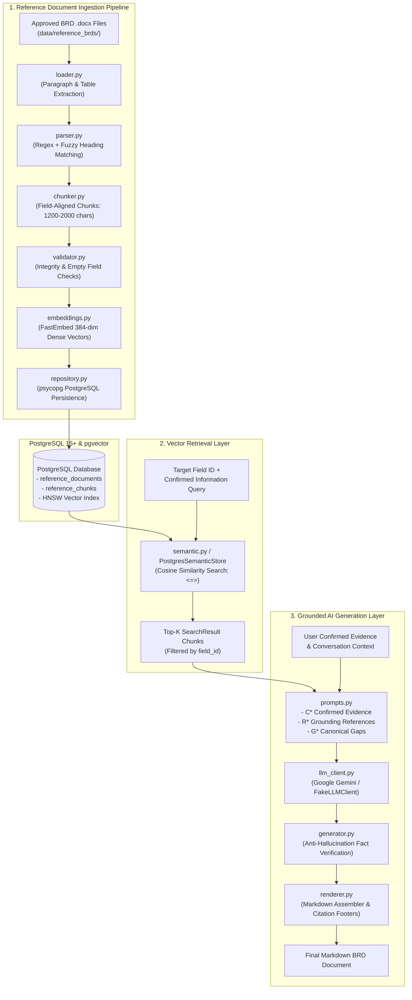
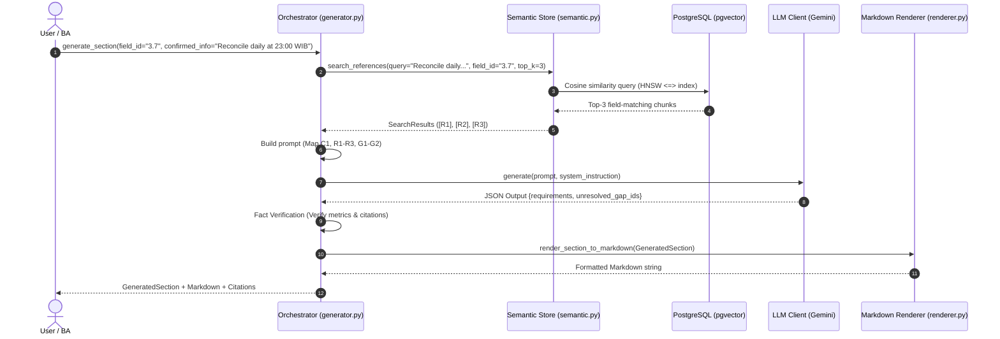

# BRD Chatbot — Reference Ingestion, Semantic pgvector Retrieval & Grounded AI Document Generation System

[](https://www.python.org/downloads/)
[](https://www.postgresql.org/)
[](https://github.com/pgvector/pgvector)
[](https://github.com/qdrant/fastembed)
[](https://ai.google.dev/)
[](https://docs.pytest.org/)
[](LICENSE)

---

## 📑 Table of Contents

- [Overview & Purpose](#-overview--purpose)
- [Key Features](#-key-features)
- [System Architecture](#-system-architecture)
  - [1. Reference Document Ingestion Pipeline](#1-reference-document-ingestion-pipeline)
  - [2. Semantic Retrieval Engine (pgvector)](#2-semantic-retrieval-engine-pgvector)
  - [3. Grounded AI Generation Engine](#3-grounded-ai-generation-engine)
  - [4. End-to-End Sequence Flow](#4-end-to-end-sequence-flow)
- [Canonical 26-Field BRD Taxonomy](#-canonical-26-field-brd-taxonomy)
- [Anti-Hallucination & Provenance Governance](#-anti-hallucination--provenance-governance)
- [Repository Structure](#-repository-structure)
- [Database Schema & Migrations](#-database-schema--migrations)
- [Installation & Setup Guide](#-installation--setup-guide)
  - [1. Prerequisites](#1-prerequisites)
  - [2. Clone & Environment Setup](#2-clone--environment-setup)
  - [3. Configure Environment Variables](#3-configure-environment-variables)
  - [4. Database Initialization & Migrations](#4-database-initialization--migrations)
- [Usage & CLI Tools](#-usage--cli-tools)
  - [Ingest Approved Reference BRDs](#1-ingest-approved-reference-brds)
  - [Run Semantic Retrieval Relevance Benchmark](#2-run-semantic-retrieval-relevance-benchmark)
  - [Interactive Section Generation Demo](#3-interactive-section-generation-demo)
- [Automated Test Suite](#-automated-test-suite)
- [Design Decisions & Technical Rationale](#-design-decisions--technical-rationale)

---

## 🎯 Overview & Purpose

**BRD Chatbot** (or **BRD Agent**) is an enterprise-grade AI system designed to draft, validate, and assemble formal **Business Requirement Documents (BRDs)** aligned with standard enterprise taxonomy.

Writing business requirements manually often suffers from inconsistent document structures, incomplete sections, missing dependencies, and the risk of unverified assumptions. When using naive Generative AI for BRD drafting, LLMs frequently hallucinate facts, invent fake Service Level Agreements (SLAs), fabricate metrics, or leak unconfirmed details from reference documents into new projects.

**BRD Chatbot solves this by enforcing:**
1. **Canonical Schema Alignment**: Content is parsed and generated strictly against **26 canonical leaf fields** organized into 5 chapters.
2. **Deterministic Field-Scoped Retrieval**: Past approved reference BRDs are indexed into PostgreSQL using `pgvector` and FastEmbed embeddings (`BAAI/bge-small-en-v1.5`), ensuring queries only retrieve relevant reference chunks from the exact matching canonical field.
3. **Strict Authority Hierarchy**: Clear programmatic boundaries between **User Confirmed Evidence (`C*`)**, **Reference Grounding (`R*`)**, and **Canonical Information Gaps (`G*`)**.
4. **Code-Level Anti-Hallucination Guards**: Automatic validation parsing for numbers, dates, SLAs, and currencies before any requirement is approved and rendered.

---

## ⚡ Key Features

- **Automated DOCX Ingestion**: Ingests Word `.docx` documents, extracts paragraphs and formatted tables, strips Table of Contents (TOC), and computes SHA-256 integrity checksums.
- **Smart Heading Normalization**: Combines Regex and sequence-matcher fuzzy matching (threshold `0.72`) to map diverse document headings to standard canonical IDs.
- **Field-Aligned Chunking**: Produces clean chunk units (1,200 – 2,000 characters) strictly bounded by canonical fields—zero cross-field leakage.
- **pgvector Vector Database**: High-performance cosine similarity retrieval in PostgreSQL with HNSW vector index acceleration.
- **FastEmbed Dense Embeddings**: 384-dimensional dense vectors generated locally without external API latency.
- **Dual LLM Client Architecture**: Supports real LLM generation via **Google Gemini (`gemini-2.5-flash`)** and deterministic `FakeLLMClient` for offline testing.
- **Provenance & Citation Footers**: Every generated section records which reference documents and chunk indices provided style grounding, rendered directly in Markdown.
- **Information Gap Tracking**: Programmatically flags pending questions (`G1`, `G2`, etc.) based on canonical schema definitions when user evidence is incomplete.
- **100% Test Coverage on Core Contracts**: 40 automated unit and integration tests covering the entire pipeline.

---

## 🏗️ System Architecture

The system operates across three interconnected layers: **Ingestion**, **Retrieval**, and **Generation**.



---

### 1. Reference Document Ingestion Pipeline

```text
[DOCX File]
    │
    ▼ loader.py
[LoadedDocument: Blocks (Paragraphs & Tables), TOC Filtered, SHA-256 Checksum]
    │
    ▼ parser.py (config/brd_fields.json)
[ParsedDocument: 26 Canonical Leaf Fields, Nested Headings Preserved]
    │
    ▼ chunker.py
[ReferenceChunks: 1200 - 2000 chars, Field-Bounded, Zero Leakage]
    │
    ▼ validator.py
[ValidationReport: Pass / Warnings / Errors]
    │
    ▼ embeddings.py (BAAI/bge-small-en-v1.5)
[384-dimensional Dense Vector Embeddings]
    │
    ▼ repository.py (PostgreSQL)
[Database: reference_documents & reference_chunks with HNSW Index]
```

### 2. Semantic Retrieval Engine (pgvector)

The retrieval engine provides a single official contract:
```python
search_references(query: str, field_id: str | None = None, top_k: int = 3) -> list[SearchResult]
```

- **Query Vectorization**: Uses `FastEmbed` to transform user text into 384-dim dense vectors.
- **Field Scoping**: Applies `WHERE rc.field_id = %s` filter so that requirements for *e.g., "Settlement Plan (3.7)"* only retrieve historical reference chunks from Section 3.7.
- **Cosine Distance Scoring**: Executes `1.0 - (rc.embedding <=> query_vec::vector)` to rank results.

### 3. Grounded AI Generation Engine

Generation is executed section-by-section in canonical sequence:

```text
Input: field_id, confirmed_information, conversation_context
   │
   ├─► Step 1: Query search_references(query, field_id=field_id, top_k=3)
   │           Assigns deterministic Grounding IDs: [R1], [R2], [R3]
   │
   ├─► Step 2: Extract Confirmed Evidence IDs: [C1], [C2], ...
   │           Extract Canonical Field Gaps from Schema: [G1], [G2], ...
   │
   ├─► Step 3: Build Structured JSON Prompt with Strict System Instructions
   │
   ├─► Step 4: Invoke LLM (Gemini API or FakeLLMClient)
   │
   ├─► Step 5: Validate JSON Output & Run Anti-Hallucination Fact Verification:
   │           • Every requirement MUST cite at least one valid C* ID.
   │           • R* IDs can ONLY be used in grounding_reference_ids (never as factual evidence).
   │           • Numbers, percentages, dates, and currencies MUST exist in the cited C* text.
   │           • Unresolved items MUST match canonical G* gap IDs.
   │
   └─► Step 6: Assemble GeneratedSection & Render Markdown with Provenance Footers
```

### 4. End-to-End Sequence Flow



---

## 📋 Canonical 26-Field BRD Taxonomy

The system aligns all document content with a 26-field canonical structure defined in [`config/brd_fields.json`](file:///Users/hibrizi/Project/brd_chatbot/config/brd_fields.json):

| Chapter | Section ID | Canonical Title | Type | Description |
| :--- | :--- | :--- | :--- | :--- |
| **Chapter 1** | `1.1` | **Overview** | *Structural* | Header section for project background & analysis |
| | `1.1.1` | Background | Leaf Field | Current situation, pain points, and triggers |
| | `1.1.2` | Business and Market Analysis | Leaf Field | Market conditions, competitor actions, industry benchmarks |
| | `1.1.3` | Relevant Historical Data | Leaf Field | Baseline metrics, past volumes, incident histories |
| | `1.2` | Business Objective | Leaf Field | Measurable target outcomes and success criteria |
| | `1.3` | Purpose of this Business Requirement | Leaf Field | Document scope, audience, and key decisions |
| | `1.4` | Program Type | Leaf Field | Initiative classification (new build, migration, compliance) |
| | `1.5` | Business Risk | Leaf Field | Operational, financial, technical, or regulatory risks |
| **Chapter 2** | `2.1` | Summary (Benefit Analysis) | Leaf Field | Expected financial and non-financial business value |
| | `2.2` | Assumption and Calculation | Leaf Field | Underlying estimation formulas, baseline data, sensitivities |
| **Chapter 3** | `3.1` | General Requirement | Leaf Field | High-level capabilities, constraints, and boundaries |
| | `3.2` | Product / Service Specification | Leaf Field | Detailed features, technical specifications, product tiers |
| | `3.3` | **Business Process** | *Structural* | Header section for operational process details |
| | `3.3.1` | Business process impact | Leaf Field | Operational changes, replaced workflows, affected teams |
| | `3.3.2` | Description | Leaf Field | Step-by-step mechanics, inputs, outputs, handoffs |
| | `3.3.3` | Security | Leaf Field | Data protection, access controls, compliance standards |
| | `3.3.4` | Organization and policy | Leaf Field | Process ownership, RACI roles, governance policies |
| | `3.3.5` | Service Delivery Plan (for new application) | Conditional Leaf | Delivery model, support SLAs, post-launch operations |
| | `3.4` | Complain Handling | Leaf Field | Customer complaint channels, escalation matrix, SLAs |
| | `3.5` | Reporting | Leaf Field | Metrics, KPIs, recipients, frequency, and formats |
| | `3.6` | Monitoring (if required) | Conditional Leaf | Alert triggers, monitoring dashboards, tracking roles |
| | `3.7` | Settlement Plan (if applicable) | Conditional Leaf | Financial reconciliation, settlement terms, discrepancies |
| | `3.8` | Assumptions and Dependencies | Leaf Field | System assumptions, external vendor/project dependencies |
| **Chapter 4** | `4.1` | Target Ready for Service | Leaf Field | Target completion dates and readiness milestones |
| | `4.2` | Commercial Launch | Leaf Field | Market launch date and go-to-market plan |
| | `4.3` | Internal Socialization Plan (if applicable) | Conditional Leaf | Stakeholder briefings and staff training schedule |
| | `4.4` | Rollout Scenario (if any) | Conditional Leaf | Phased rollout, pilot testing, or big-bang launch plan |
| **Chapter 5** | `5.1` | Product/Service Retirement Plan | Leaf Field | Decommissioning triggers, data migration, sunset plan |

---

## 🛡️ Anti-Hallucination & Provenance Governance

To ensure zero hallucination in critical business documents, the system implements a **Tripartite Authority Hierarchy**:

```text
┌─────────────────────────────────────────────────────────────────────────────┐
│                       TRIPARTITE AUTHORITY HIERARCHY                        │
├─────────────────────────────────────────────────────────────────────────────┤
│  [C*] CONFIRMED PROJECT EVIDENCE (Authoritative Truth)                       │
│  - The ONLY source of facts, dates, SLAs, metrics, and business rules.      │
│  - Every generated requirement MUST cite at least one valid C* ID.          │
├─────────────────────────────────────────────────────────────────────────────┤
│  [R*] RETRIEVED REFERENCE BRDs (Non-Authoritative Style Grounding)          │
│  - Used SOLELY for phrasing, terminology, and professional tone.            │
│  - Can NEVER justify a requirement or introduce new numbers/rules.          │
├─────────────────────────────────────────────────────────────────────────────┤
│  [G*] CANONICAL INFORMATION GAPS (Schema-Derived Incomplete Items)          │
│  - Selected when confirmed evidence leaves canonical questions unanswered.   │
│  - Free-form hallucinated gap topics are strictly rejected by the parser.   │
└─────────────────────────────────────────────────────────────────────────────┘
```

### Programmatic Fact Verification (`_validate_requirement_facts`)
During generation, every requirement emitted by the LLM is inspected by `generator.py`:
- **Numeric & Metric Tokens**: Extracts currency values, percentages, and quantities (e.g. `24 hours`, `99.9%`, `$5,000`). If a token does not appear in the cited `C*` evidence, generation halts immediately with `UnsafeGenerationError`.
- **Word Numbers**: Detects English word numbers (`twenty`, `thirty`, `hundred`) to prevent LLMs bypassing numeric checks via natural language phrasing.
- **Reference Isolation**: Rejects any output attempting to use `R*` reference identifiers in `evidence_ids`.

---

## 📂 Repository Structure

```text
brd_chatbot/
├── config/
│   ├── brd_fields.json               # Canonical 26-field taxonomy, questions & dependencies
│   └── reference_corpus.json         # Manifest of 15 approved seed reference BRDs
├── data/
│   └── reference_brds/               # 15 approved reference DOCX documents
│       ├── 1 - BRD_Guest_Checkout_Payment_Flow_v1.docx
│       ├── 2 - BRD_Inventory_Management_v1.docx
│       └── ... (15 approved documents)
├── ingest/                           # Ingestion & document parsing pipeline
│   ├── loader.py                     # DOCX paragraph & table reader, TOC filter, SHA-256
│   ├── parser.py                     # Heading matcher (Regex + SequenceMatcher fuzzy matching)
│   ├── chunker.py                    # Field-aligned chunking (1200 - 2000 chars per chunk)
│   ├── validator.py                  # Chunk & field quality validation rules
│   └── repository.py                 # PostgreSQL persistence layer using psycopg v3
├── retrieval/                        # Vector embeddings & semantic retrieval
│   ├── embeddings.py                 # FastEmbed generator (384-dim BAAI/bge-small-en-v1.5)
│   ├── semantic.py                   # PostgresSemanticStore (pgvector cosine similarity)
│   ├── lexical_baseline.py           # Offline BM25 search engine for evaluation baseline
│   └── models.py                     # Immutable dataclasses (LoadedDocument, ReferenceChunk, SearchResult)
├── generation/                       # LLM orchestration & document generation
│   ├── generator.py                  # Core generation engine & anti-hallucination fact validator
│   ├── llm_client.py                 # GeminiLLMClient & deterministic FakeLLMClient
│   ├── models.py                     # Dataclasses (ReferenceCitation, GeneratedSection, GeneratedDocument)
│   ├── prompts.py                    # Structured JSON prompt builders (C*, R*, G* mappings)
│   └── renderer.py                   # Markdown document renderer with citation footers
├── migrations/                       # PostgreSQL database migrations
│   ├── 001_create_reference_corpus.sql  # Documents and chunks tables
│   └── 002_add_pgvector.sql             # pgvector extension & HNSW cosine distance index
├── scripts/                          # Operator CLI tools
│   ├── ingest_references.py          # Single-command batch/single reference ingestion
│   ├── evaluate_retrieval.py         # Hit@1, Hit@3, and MRR benchmark evaluation
│   └── demo.py                       # Interactive runtime smoke test and demo CLI
├── tests/                            # Comprehensive automated test suite (40 tests)
│   ├── fixtures/
│   │   └── simulated_chat_eval_dataset.json # Simulated user queries for relevance evaluation
│   ├── test_ingest.py                # Parser, chunker, and repository unit tests
│   ├── test_lexical_baseline.py      # BM25 baseline verification tests
│   ├── test_relevance.py             # Semantic retrieval relevance & Hit@K tests
│   ├── test_generation.py            # Anti-hallucination, citation, and prompt tests (25 tests)
│   └── test_synthetic_future_brd.py  # End-to-end integration test for future BRD (Sequence 16)
├── .env.example                      # Sample environment variables
├── requirements.txt                  # Python dependencies
└── README.md                         # Project documentation
```

---

## 🗄️ Database Schema & Migrations

### `reference_documents` Table
Stores high-level metadata for each approved reference document.

```sql
CREATE TABLE reference_documents (
    id BIGSERIAL PRIMARY KEY,
    document_key VARCHAR(150) NOT NULL UNIQUE,
    sequence_no SMALLINT NOT NULL UNIQUE,
    title TEXT NOT NULL,
    source_filename TEXT NOT NULL,
    approval_status VARCHAR(20) NOT NULL DEFAULT 'approved',
    source_checksum VARCHAR(64),
    created_at TIMESTAMPTZ NOT NULL DEFAULT CURRENT_TIMESTAMP,
    updated_at TIMESTAMPTZ NOT NULL DEFAULT CURRENT_TIMESTAMP
);
```

### `reference_chunks` Table
Stores field-aligned text chunks with vector embeddings and HNSW indexing.

```sql
CREATE TABLE reference_chunks (
    id BIGSERIAL PRIMARY KEY,
    document_id BIGINT NOT NULL REFERENCES reference_documents(id) ON DELETE CASCADE,
    field_id VARCHAR(20) NOT NULL,
    field_title TEXT NOT NULL,
    chunk_index INTEGER NOT NULL DEFAULT 0,
    content TEXT NOT NULL,
    char_count INTEGER NOT NULL,
    metadata JSONB NOT NULL DEFAULT '{}'::jsonb,
    embedding vector(384), -- BAAI/bge-small-en-v1.5 dense vector
    created_at TIMESTAMPTZ NOT NULL DEFAULT CURRENT_TIMESTAMP,
    CONSTRAINT uq_reference_document_field_chunk UNIQUE (document_id, field_id, chunk_index)
);

-- Indices for rapid field filtering and vector similarity search:
CREATE INDEX idx_reference_chunks_field_id ON reference_chunks(field_id);
CREATE INDEX idx_reference_chunks_embedding ON reference_chunks USING hnsw (embedding vector_cosine_ops);
```

---

## 🚀 Installation & Setup Guide

### 1. Prerequisites

- **Python 3.10+**
- **PostgreSQL 15+** with the **`pgvector`** extension installed.
  - *macOS (Homebrew)*: `brew install postgresql pgvector`
  - *Ubuntu/Debian*: `sudo apt install postgresql-15 postgresql-15-pgvector`
- **Google Gemini API Key** (optional for live generation, get one from [Google AI Studio](https://aistudio.google.com/)).

### 2. Clone & Environment Setup

```bash
# Clone the repository
git clone https://github.com/Frazanhibriz/brd-agent.git
cd brd-agent

# Create and activate virtual environment
python3 -m venv .venv
source .venv/bin/activate

# Install dependencies
pip install -r requirements.txt
```

### 3. Configure Environment Variables

Copy `.env.example` to `.env` and fill in your database and API credentials:

```bash
cp .env.example .env
```

Edit `.env`:
```ini
DB_HOST=localhost
DB_PORT=5432
DB_NAME=brd_chatbot
DB_USER=your_postgres_username
DB_PASSWORD=your_postgres_password

# Required for live LLM generation (optional for dry-run/unit tests)
GEMINI_API_KEY=your_gemini_api_key
```

### 4. Database Initialization & Migrations

Create the database and apply SQL migrations:

```bash
# Create database
createdb -h localhost -U postgres brd_chatbot

# Apply migrations
psql -h localhost -U postgres -d brd_chatbot -f migrations/001_create_reference_corpus.sql
psql -h localhost -U postgres -d brd_chatbot -f migrations/002_add_pgvector.sql
```

---

## 🛠️ Usage & CLI Tools

### 1. Ingest Approved Reference BRDs

The operator tool [`scripts/ingest_references.py`](file:///Users/hibrizi/Project/brd_chatbot/scripts/ingest_references.py) loads, parses, chunks, generates embeddings, and saves all 15 reference BRDs in one command:

```bash
# Dry-run validation (validates parsing & chunking without DB writes):
python scripts/ingest_references.py --all --dry-run

# Ingest a single document by its sequence number (e.g. Document 11 - Payroll Processing):
python scripts/ingest_references.py --document 11

# Full production ingestion (embeds 384-dim vectors & saves to PostgreSQL):
python scripts/ingest_references.py --all
```

**Ingestion Output Sample:**
```text
============================================================
Document: Payroll Processing
Source: 11 - BRD_Payroll_Processing.docx
Canonical fields: 26
Detected fields: 26
Empty fields: 0
Missing fields: 0
Generated chunks: 32
  1.1.1 -> 1 chunk(s)
  1.1.2 -> 1 chunk(s)
  ...
Generating vector embeddings for 32 chunk(s)...
Database writes: DONE (inserted 32 chunks, 32 embedded)
Result: PASS
```

---

### 2. Run Semantic Retrieval Relevance Benchmark

Benchmark retrieval accuracy against simulated Chat queries using [`scripts/evaluate_retrieval.py`](file:///Users/hibrizi/Project/brd_chatbot/scripts/evaluate_retrieval.py):

```bash
python scripts/evaluate_retrieval.py
```

**Benchmark Results:**
```text
======================================================================
AI2-4 SEMANTIC PGVECTOR RETRIEVAL RELEVANCE EVALUATION (15 Simulated Queries)
======================================================================
Hit@1 Rate : 15/15 (100.0%)
Hit@3 Rate : 15/15 (100.0%)
MRR Score  : 1.0000
======================================================================
[PERFECT MATCH] All simulated Chat-style queries achieved Hit@1 / Hit@3!
```

---

### 3. Interactive Section Generation Demo

Test end-to-end grounded generation with real PostgreSQL retrieval and Google Gemini using [`scripts/demo.py`](file:///Users/hibrizi/Project/brd_chatbot/scripts/demo.py):

```bash
python scripts/demo.py
```

You will be prompted to enter a target canonical field and project information:
```text
Please enter field ID (e.g. 3.7): 3.7
Please enter confirmed information: Reconciliation between merchant transactions and bank disbursements occurs automatically at 23:00 WIB. Discrepancies are logged in an exceptions queue.
```

The system will execute pgvector retrieval for Section `3.7`, construct the grounded prompt, invoke Gemini, validate factual accuracy, and render the output:

```markdown
### Section 3.7: Settlement Plan (if applicable)

- The system shall automatically execute reconciliation between merchant transactions and bank disbursements daily at 23:00 WIB. [R1]
- The system shall record and route any reconciliation discrepancies into an exceptions queue for manual review. [R2]

**Grounding References:**
- [R1] Leave Management System (`brd_leave_management_system`, Chunk 0) - Section 3.7
- [R2] Payroll Processing (`brd_payroll_processing`, Chunk 1) - Section 3.7
```

---

## 🧪 Automated Test Suite

The test suite contains **40 automated tests** across 5 test suites.

```bash
pytest tests/ -v
```

### Test Suite Coverage Breakdown

```text
tests/
├── test_generation.py (25 tests)
│   ├── Canonical field validation & rejection of non-answerable fields
│   ├── Field-scoped search_references contract enforcement
│   ├── Citation provenance mapping & rejection of invented citations
│   ├── Empty confirmed information handling (graceful unresolved output)
│   ├── Authority hierarchy validation in prompts (C* vs R* vs G*)
│   ├── Fact validation: rejection of unconfirmed numbers, dates, currencies
│   ├── Rejection of R* references promoted to factual evidence
│   ├── Strict canonical gap validation (rejection of free-form gaps)
│   └── Canonical order assembly for final GeneratedDocument
├── test_ingest.py (7 tests)
│   ├── Canonical schema loader integrity
│   ├── Regex & fuzzy heading matcher
│   ├── Reference corpus manifest loading & filename sequence resolution
│   ├── Document parser & chunker logic
│   ├── Transactional repository persistence mocking
│   └── Nested subheading preservation within parent fields
├── test_lexical_baseline.py (4 tests)
│   ├── Standalone BM25 keyword matching
│   ├── Field filtering in BM25
│   └── Empty query and edge case handling
├── test_relevance.py (3 tests)
│   ├── search_references contract verification
│   ├── Evaluation dataset schema validation
│   └── Hit@1, Hit@3, and MRR benchmark verification
└── test_synthetic_future_brd.py (1 test)
    └── Future BRD integration test (Sequence 16)
```

**Run specific test modules:**
```bash
# Run only generation tests:
pytest tests/test_generation.py -v

# Run only ingestion tests:
pytest tests/test_ingest.py -v
```

---

## 💡 Design Decisions & Technical Rationale

1. **Why 26 Canonical Leaf Fields?**
   Enterprise BRDs require standardization to ensure consistency across multiple teams and vendors. By fixing the document structure to 26 canonical fields, downstream systems (engineering, QA, procurement) can ingest BRD sections reliably.

2. **Why Field-Scoped Vector Retrieval?**
   Global vector search often retrieves chunks from irrelevant sections (e.g. searching for a security requirement might return background narratives). Filtering vector search by `field_id` ensures that Section 3.3.3 (Security) is only grounded in historical Security sections.

3. **Why FastEmbed (`BAAI/bge-small-en-v1.5`)?**
   FastEmbed runs locally inside the Python process via ONNX Runtime without requiring external embedding API calls. It produces compact 384-dimensional dense vectors with exceptional semantic accuracy and minimal memory footprint.

4. **Why Strict Anti-Hallucination via Code-Level Verification?**
   Relying on system prompts alone is insufficient for enterprise compliance. Implementing deterministic regex and numeric token verification in Python ensures that even if an LLM generates an unconfirmed number, the system catches and rejects it before document rendering.

---

## 📄 License

Distributed under the MIT License. See `LICENSE` for details.
